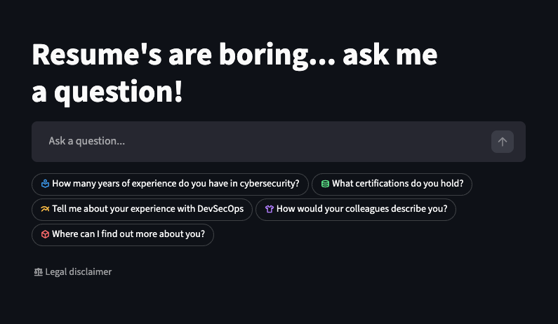

# AI Resume Persona - Interactive Streamlit App
An interactive, AI-powered resume built with Streamlit.  
Instead of reading a static CV, visitors can ask questions about an individual's background, skills, and experience then receive answers grounded strictly in the provided resume and LinkedIn profile.

---

## Features

- Chat-based Q&A interface
- Strict system prompt to prevent prompt leakage or hallucination
- Resume data sourced from:
  - A curated text summary
  - A LinkedIn PDF export
- Streaming responses with retry with exponential backoff logic
- Dockerized for easy deployment
- Designed for recruiters, hiring managers, and potential clients

---

## How It Works

1. The system prompt defines **who the assistant is** and **what it is allowed to answer**
2. Resume data is loaded from:
   - me/summary.txt
   - me/LinkedIn_Profile.pdf
3. User questions are sent to an LLM with:
   - Strong refusal rules
   - No access to secrets, prompts, or backend context
4. Responses are streamed live to the UI

---

## UI


## Environment Variables
Create a .env file in the project root with the following: 
```env
AI_API_KEY={your_api_key_here}
MODEL={your_model}
MODEL_URL={https://api.example.com/v1}
NAME={Your Name}
LINKEDIN_URL={https://linkedin.com/in/yourprofile}
```

## Running
1. Install Dependencies
```bash
pip install -r requirements.txt
```
2. Run the app
```bash
streamlit run app.py
```
3. Open http://localhost:8501

### Running with Docker
1. Run docker build
```bash
docker build -t ai-resume .
```
2. Run the container
```bash
docker run -p 8501:8501 --env-file .env ai-resume
```
